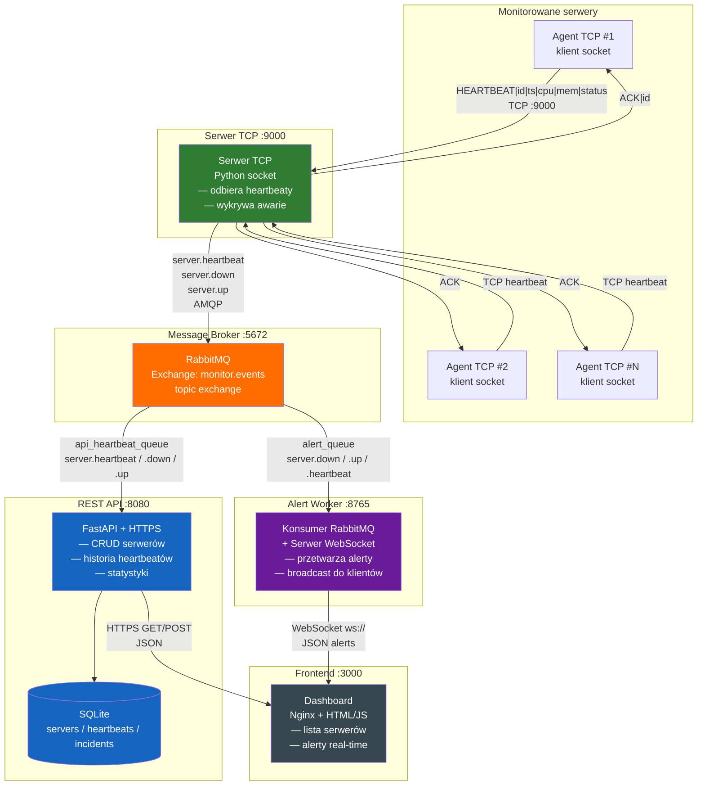

# Architektura systemu Watchdog

## Opis systemu

Watchdog to system monitorowania dostępności serwerów. Składa się z:
- **Agentów TCP** — zainstalowanych na monitorowanych serwerach, wysyłających cykliczne heartbeaty
- **Serwera TCP** — odbierającego heartbeaty i wykrywającego awarie
- **Kolejki wiadomości (RabbitMQ)** — do asynchronicznej komunikacji między usługami
- **REST API (HTTPS)** — do zarządzania serwerami i przeglądania danych
- **Serwera WebSocket** — do powiadomień w czasie rzeczywistym
- **Dashboardu** — panelu webowego wyświetlającego status serwerów i alerty

## Diagram architektury

### Wymagania rozszerzające (zrealizowane 2 z min. 1)

| Wymaganie | Realizacja |
|-----------|-----------|
| **Message Queue** | RabbitMQ — asynchroniczna komunikacja między Serwerem TCP, REST API i Alert Workerem |
| **WebSocket** | Serwer WebSocket w Alert Worker — powiadomienia real-time do dashboardu |

## Użyte technologie

| Komponent | Technologia |
|-----------|-------------|
| Serwer/Agent TCP | Python, moduł `socket` |
| REST API | Python, FastAPI, SQLAlchemy |
| Baza danych | SQLite |
| Kolejka wiadomości | RabbitMQ (AMQP) |
| WebSocket | Python, biblioteka `websockets` |
| Dashboard | HTML/CSS/JavaScript |
| Konteneryzacja | Docker, Docker Compose |
| HTTPS | Certyfikat self-signed (OpenSSL) |

## Przepływ danych

1. **Agent TCP** wysyła heartbeat (`HEARTBEAT|server_id|timestamp|cpu|mem|status`) do **Serwera TCP** przez socket TCP
2. **Serwer TCP** odpowiada `ACK`, parsuje dane i publikuje zdarzenie `server.heartbeat` do **RabbitMQ**
3. Jeśli agent nie wysyła heartbeata przez 30s → Serwer TCP publikuje `server.down`
4. **REST API** konsumuje zdarzenia z RabbitMQ i zapisuje je do **SQLite**
5. **Alert Worker** konsumuje zdarzenia `server.down`/`server.up` i broadcastuje je przez **WebSocket**
6. **Dashboard** pobiera listę serwerów z REST API (HTTPS) i odbiera alerty na żywo przez WebSocket
